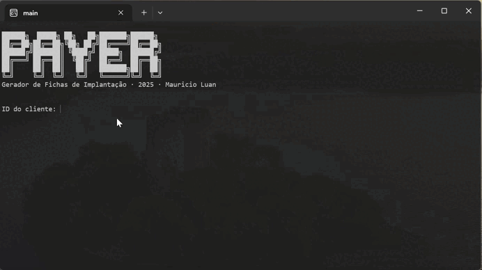
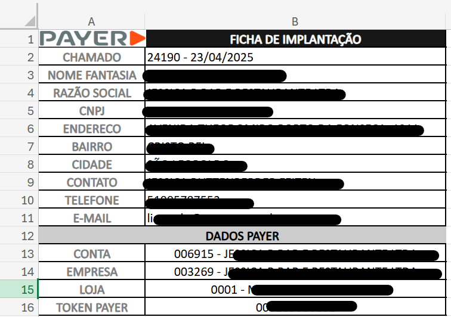

# Gerador de fichas de implantação
Este script automatiza a coleta de dados de um cliente e de um chamado a partir da API do TomTicket. O programa solicita os IDs de um cliente e de um chamado, faz requisições à API utilizando um token de autenticação, e organiza as informações relevantes, como razão social, nome fantasia, CNPJ, endereço e contatos. Essas informações são usadas para gerar uma ficha de implantação em uma planilha Excel, que é salva em um diretório organizado por razão social no Google Drive. O script também cria pastas conforme necessário e insere um logo na planilha. Após a execução, arquivos temporários são removidos.

Criei esse script pois uma das minhas atribuições como Analista de Suporte Junior era realizar a criação dessa ficha de implantação manualmente. Eu precisava ficar copiando e colando os dados do tom ticket para a planilha, e depois acessar o google drive web, aí criar uma pasta com o nome da razão social do cliente e, por fim, colar a planilha lá dentro. Era um trabalho repetitivo e demorado. Agora com esse programinha, consigo ser muito mais produtivo.

## Tecnologias

- **Bibliotecas Python**:
  - `requests` - Requisições HTTP à API.
  - `openpyxl` - Geração de planilhas Excel estilizadas.
  - `python-dotenv` - Gerenciamento de variáveis de ambiente.
  - `re` - Extração de dados via expressões regulares.
  - `datetime` - Formatação de datas.
  - `os` - Manipulação de arquivos e pastas.

- **Ferramentas**:
  - Google Drive (armazenamento das fichas).
  - TomTicket API (fonte dos dados).
 
- ** Ver `requirements.txt` para instalação das dependências.**

## Progama executando:

## Planilha que é gerada:

